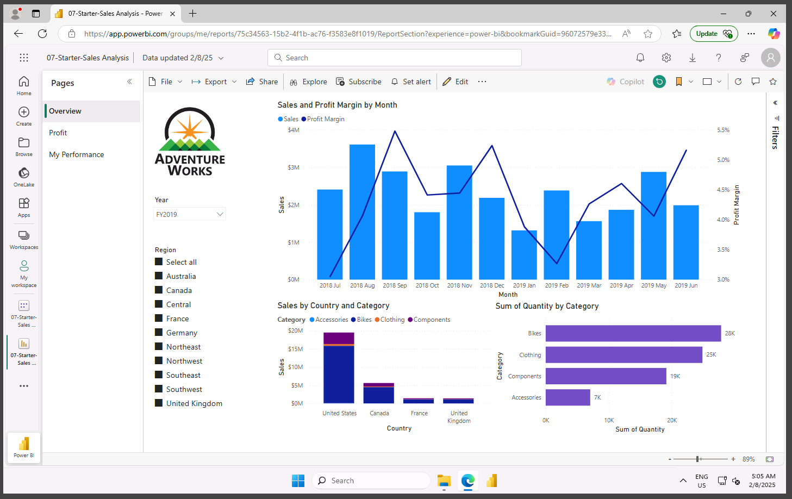
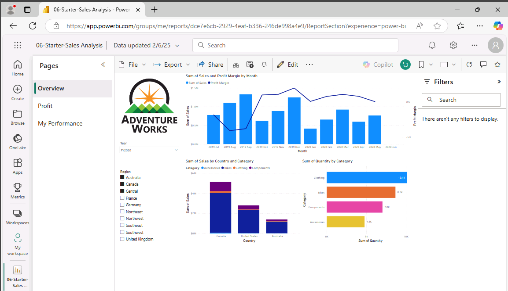
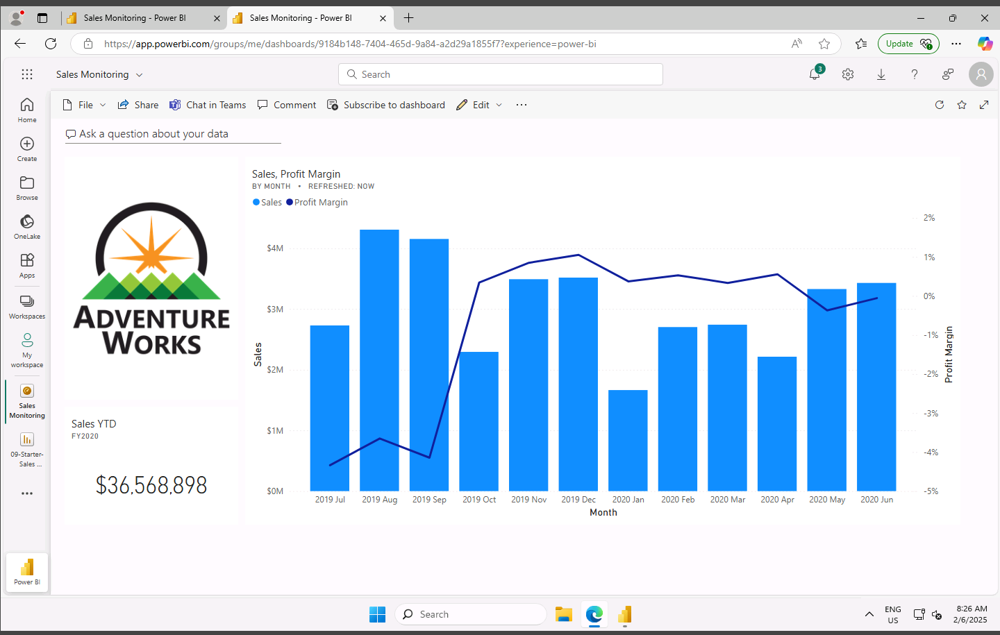
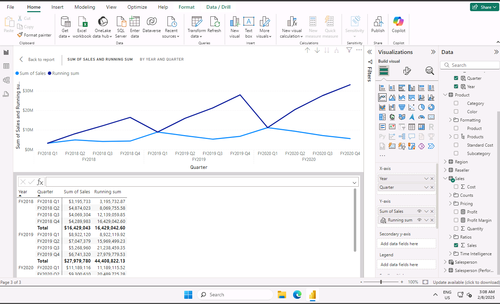

# Data Analysing and Visualising with PowerBI

**Overview**

In this project, I undertook a comprehensive learning journey through the Power BI Skillable Labs, which provided me with practical hands-on experience in data analysis and visualisation. Over the course of 11 labs, I built a solid foundation in working with Power BI, covering various aspects of data manipulation, modelling, DAX calculations, report design, and security enforcement. Each lab focused on a specific skill set, enabling me to develop a robust understanding of Power BI’s capabilities and how to apply them effectively for data analysis and reporting.

Throughout this learning experience, I have become proficient in transforming complex datasets into clear and insightful visualisations. My key strengths in data visualisation include:

**Selecting the Right Visual Representation:** I excel at choosing the most suitable chart types for different data sets, whether it’s bar charts, line graphs, or scatter plots. My focus is on selecting the chart type that best communicates the insights and effectively conveys the intended message.

**Applying Colour and Design Principles:** I use thoughtful colour schemes and design principles to emphasize critical information, ensuring that charts and reports are not only visually appealing but also easy for viewers to understand and interpret.

**Creating Interactive Data Visuals:** I specialise in building dynamic, interactive dashboards and visualisations with tools like Power BI. These visuals allow users to explore and interact with data, providing a deeper and more personalized understanding of the insights.

**Crafting Data Narratives:** I have a strong ability to weave data into a compelling narrative, guiding audiences through the key insights and helping them relate to the story behind the numbers. This approach ensures that my presentations are both engaging and impactful, making complex data accessible and meaningful.

**Data Source: Just IT, Google, ChatGPT**

**Full Project work book [here.](https://drive.google.com/file/d/1-4u_ub6kUB8LYe_9Oz4BV6WLi7HihK_p/view?usp=drive_link)**

**Click [here](https://github.com/Alamin-analyser/Data-visualisation-in-Tableau-Music-Industry) to see another Project.**
